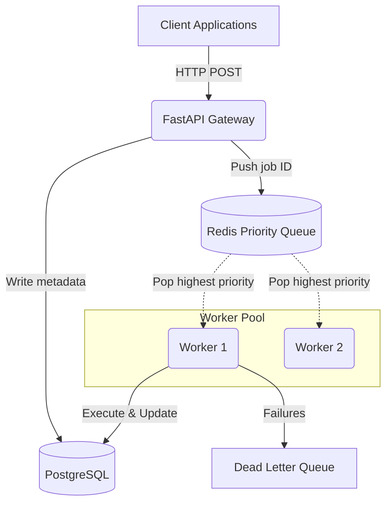

# ⚡ Distributed Task Queue System

A robust, production-ready, priority-based job processing service built from the ground up to handle high-throughput background tasks. 

This system elegantly bridges asynchronous job submission via **FastAPI** with reliable persistence in **PostgreSQL** and lightning-fast priority polling via **Redis**, executed by a scalable pool of Python workers.

---

## 🎯 System Architecture



---

## ✨ Key Features & Engineering Decisions

- **Custom Priority Queue via Binary Min-Heap:** Leverages Python's `heapq` module to create a highly efficient `O(log n)` priority queue. Lower numbers run first, while maintaining insertion order for identical priorities.
- **Lazy Deletion Pattern:** Instead of triggering an expensive `O(n)` search to mutate heap entries when a job is cancelled or updated, a new entry is pushed and stale entries are efficiently ignored on pop.
- **Robust Persistence:** PostgreSQL acts as the single source of truth for job states, ensuring zero data loss during worker crashes.
- **Redis Coordination:** Fast, distributed locking and claiming mechanisms allowing multiple worker nodes to pull from the queue simultaneously without race conditions.
- **Dead-Letter Queue (DLQ):** Automatic retries with exponential backoff, eventually routing poisoned jobs to a DLQ for manual inspection.

---

## 🛠️ Tech Stack

| Component | Technology |
|---|---|
| **API Framework** | FastAPI (with `uvicorn`) |
| **Database** | PostgreSQL (managed via `SQLAlchemy` & `Alembic`) |
| **In-Memory Store**| Redis |
| **Validation** | Pydantic v2 |
| **Testing** | `pytest`, `pytest-asyncio` |

---

## 🚀 Deployment (Render 1-Click)

This project is fully containerized and configured for **Render.com**. 
The included `render.yaml` file defines an Infrastructure-as-Code blueprint that automatically spins up:
1. A managed **PostgreSQL** instance
2. The **FastAPI** Web Service
3. A background **Worker Node**

*(Note: Requires a managed Redis instance URL to be added to the environment variables).*

---

## 💻 Local Development

### Prerequisites
- Python 3.11+
- PostgreSQL
- Redis Server

### Setup
```bash
git clone https://github.com/your-username/task-queue-system.git
cd task-queue-system

python -m venv .venv
source .venv/bin/activate  # On Windows: .venv\Scripts\activate

pip install -r requirements.txt
```

### Running Tests
Unit tests comprehensively cover the heap logic and API endpoints.
```bash
pytest -v
```

### Starting the Server
```bash
uvicorn app.main:app --reload
```
Visit `http://127.0.0.1:8000/docs` for the interactive Swagger API documentation.

---

## 📄 License
MIT License. Built for performance and reliability.
